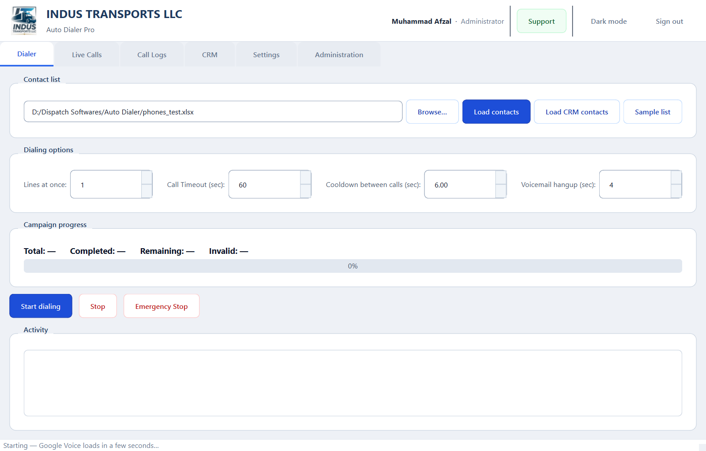
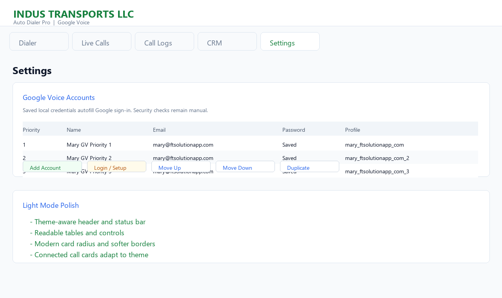
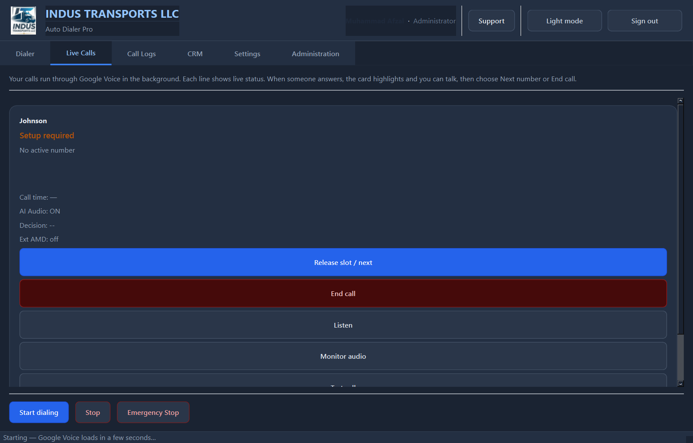
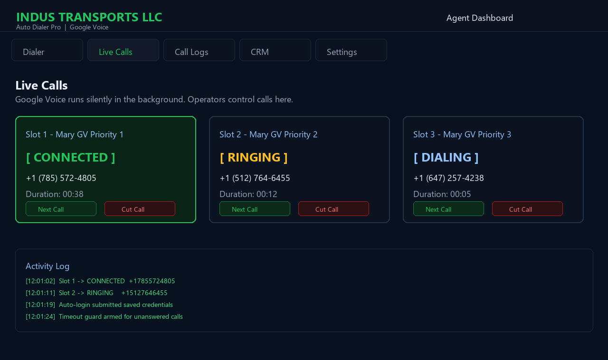

<div align="center">

<p align="center">
  
</p>

# Indus Transports Auto Dialer

**Professional Windows auto dialer — Google Voice, AMD, predictive pacing.**

Multi-line dialing · AMD · CRM · Excel lists · Predictive pacing

[](https://github.com/mafzalkalwardev/indus-transport-auto-dialer/actions/workflows/test.yml)
[](https://www.python.org/)
[](https://www.microsoft.com/windows)
[](https://www.riverbankcomputing.com/software/pyqt/)
[](https://cursor.com)
[](LICENSE)
[](CONTRIBUTING.md)

[Features](#features) · [Quick Start](#quick-start) · [Documentation](#documentation) · [Screenshots](#-screenshots) · [Contributors](#contributors) · [Contributing](CONTRIBUTING.md)

</div>

---

Professional Windows desktop dialer for **INDUS TRANSPORTS LLC**. Agents use a simple branded app while Google Voice runs in the background on each line.

## 🖼 Screenshots

Captured from the live application UI.

| Dialer | Settings | Live calls |
|:--|:--|:--|
|  |  |  |



---

## Documentation

| Doc | Purpose |
|-----|---------|
| [CONTRIBUTING.md](CONTRIBUTING.md) | Dev setup and PR guidelines |
| [SECURITY.md](SECURITY.md) | Vulnerability reporting |
| [CODE_OF_CONDUCT.md](CODE_OF_CONDUCT.md) | Community standards |
| [docs/RUNBOOK.md](docs/RUNBOOK.md) | Operator runbook |
| [docs/AMD_TESTING.md](docs/AMD_TESTING.md) | AMD / pacing test guide |
| [CLIENT.md](CLIENT.md) | End-user install and daily use |
| [CLIENT_DELIVERY.md](CLIENT_DELIVERY.md) | How to package and deliver to clients |


## Who uses what

| Role | Who | What they can do |
|------|-----|------------------|
| **Administrator** | You (owner) | First account at install, **Administration** tab, add Google Voice lines, connect accounts, create client users |
| **Agent** | Your clients / dialers | Sign in with credentials you create, load lists, start dialing, listen to lines, view logs and CRM |

**Typical setup (your PC = administrator)**

1. Install the app and create the **administrator** account (once).
2. In **Settings**, add each Google Voice line (email + password) — the app signs in automatically in the background.
3. In **Administration → Export client package…**, create a folder for each client PC (agent login + voice profiles + config).
4. On the **client PC**, install the app, copy the package contents into the app folder, run once — they see **Agent sign-in** only (no admin setup wizard).
5. Give each client **only** their email and password from the export step.

Agents do **not** see Google Voice settings, cannot add voice accounts, and cannot manage users. On a client workstation, even an admin password will not grant administrator features.

## Client PC install (agent-only)

Use this when you configure everything on **your** machine and deliver a ready folder to the client.

### On your PC (administrator)

1. Complete Google Voice setup in **Settings**.
2. **Administration** → **Export client package…**
3. Enter the client’s name, login email, and password (8+ characters).
4. Choose a save location (e.g. Desktop). You get a folder like `IndusTransports_AutoDialer_Client` with:
   - `dialer_config.json` (`deployment_mode: client`)
   - `logs/crm.sqlite3` (single agent account)
   - `data/gv_accounts.json` and `chrome_profiles/` (signed-in voice lines)
   - `CLIENT_SETUP.txt` (instructions and credentials summary)

CLI alternative:

```bash
python scripts/prepare_client_install.py --name "Jane Agent" --email jane@example.com --password "TheirPassword8"
```

### On the client PC

1. Install the same app (Python source or built EXE).
2. Copy **everything** from the export folder into the app directory (merge `logs`, `data`, `chrome_profiles`, replace `dialer_config.json`).
3. Run the app — first screen is **Agent sign-in** only.
4. Client signs in with the email/password you set during export.

If the client sees “Workstation not configured”, the `logs` folder from the package was not copied correctly.

## Features

- Light, client-ready interface
- Hidden Google Voice browser per line (`QWebEngineView`)
- **Automatic sign-in** using saved email/password and persistent profiles
- **Live browser panel** on any line — hear and talk through the embedded Google Voice call
- **Test call** on every line — place one manual call without starting a campaign
- Live status: Waiting, Ringing, On call, Voicemail
- Excel contact import, call timeout, voicemail auto-hangup
- Local CRM and call history
- Windows EXE build script

## Requirements

- Windows 10 or 11
- Python 3.10+ (for development)
- Google Voice account per line
- Microphone/speakers allowed when prompted

```bash
pip install -r requirements.txt
```

## Run

```bash
python autodialer_gui.py
```

## Google Voice lines (administrator)

### Add a line

1. **Settings** → **Add account**
2. Fill in **Display name**, **Google email**, and **Password**
3. Leave **Sign in automatically in background** selected (recommended)
4. The app signs in headless — no window unless Google requires CAPTCHA/2FA
5. If verification is needed: **Settings** → select the line → **Connect account**, finish in the browser, then close

Passwords are stored only in `data/gv_accounts.json` on this PC (not committed to git).

### Duplicate a line (no second login)

**Duplicate** copies the entire browser profile from the source line. If the original was already signed in, the copy is **ready immediately** — no password or login step.

### Connect manually

**Connect account** opens the sign-in window when automatic login fails or Google asks for 2FA.

### Session files

- Profiles: `chrome_profiles/<profile_name>/`
- Ready flag: `chrome_profiles/<profile_name>/.gv_session_ok`

## Dialing workflow (agent or admin)

1. **Dialer** → choose Excel file → **Load contacts** (or **Sample list** for testing)
2. Set **Lines at once**, **Call timeout**, **Voicemail hangup**
3. Confirm each line shows **Ready** on **Live Calls**
4. **Start dialing**
5. On **Live Calls**:
   - **On call** — the answered line highlights and opens its embedded browser panel so the agent can talk
   - **Voicemail** — app hangs up and moves on automatically
   - **Next number** / **End call** — manual control

## Confirmed call-state pipeline

The dialer follows a VICIdial-style state pipeline:

```text
IDLE
-> DIALING
-> RINGING
-> ANSWERED_PENDING
-> CONNECTED / VOICEMAIL / BUSY / NO_ANSWER / FAILED
-> LOG_RESULT
-> NEXT_LEAD
```

Important safety rules in the current implementation:

- `RINGING` is never treated as `VOICEMAIL`, `FAILED`, or `ENDED`.
- Voicemail detection is allowed only after answer evidence such as a call timer
  or enabled in-call controls.
- The app does not hang up during ringing before the configured call timeout.
- Human/live answer is promoted only after the local decision engine classifies
  the call as human/live, not merely because the outbound call is ringing.
- Each final state is logged once, then the slot cools down and moves to the
  next lead.

Google Voice dialing uses DOM/BOM control inside the embedded browser. The
automation refuses stale call buttons whose label contains a different phone
number than the current lead. If Google Voice already opened a call panel, the
recovery path starts call-state polling instead of reloading the page.

## Dry-run and approved live testing

For scheduler testing without placing calls, set this in `dialer_config.json`:

```json
"dry_run_mode": true
```

Dry-run simulates `DIALING -> RINGING -> NO_ANSWER` and lets you verify queueing,
logging, retries, cooldown, and UI behavior without touching Google Voice. Keep
it `false` for real calling.

Live smoke tests must use only owner-approved test or CRM numbers:

```bash
python scripts/live_call_smoke.py --from-crm --crm-limit 2 --call-timeout 45
```

Do not mass dial or call random numbers for verification.

## Live line panel

On **Live Calls**, click **Listen** on any line to open its embedded Google Voice view. When a person answers, the app automatically switches to **Live Calls**, highlights the picked-up line, and opens that same panel. Use the panel to talk through the computer mic/speakers, then choose **Release slot / next** or **End call**.

## Reliability (watchdog, retries, logging)

For long campaigns (many numbers, several lines):

- **Watchdog** — restarts a stuck or high-memory line automatically (`logs/dialer.log`).
- **Retries** — failed dials retry up to 3 times (5s / 15s / 45s backoff) before **FAILED** in logs.
- **Memory** — HTTP cache cleared when starting/stopping a campaign; lines recycled after ~75 calls or high WebEngine RAM.

Tune in `dialer_config.json` — see [docs/RUNBOOK.md](docs/RUNBOOK.md).

**First-time setup:** copy `dialer_config.example.json` to `dialer_config.json` (defaults: 1 line, 6s cooldown). Local config is not tracked in git. On the **Dialer** tab, use **Apply stable mode** for safe settings on 8 GB PCs.

**Dev cycle (test + optional push):** `.\scripts\dev_cycle.ps1` or `.\scripts\dev_cycle.ps1 -Push`

See [docs/GV_DIAL_RESEARCH.md](docs/GV_DIAL_RESEARCH.md) for Google Voice web dialing notes.

Load testing: [docs/LOAD_TEST.md](docs/LOAD_TEST.md) and `python scripts/generate_load_test_list.py`.

## How call detection works

The app reads Google Voice page state and fuses it with optional local AI audio features.

| Status | Meaning |
|--------|---------|
| Ringing | Outbound ring |
| On call | Person answered (timer or hold/mute controls) |
| Voicemail | Greeting / beep detected → auto hangup after configured seconds |
| Waiting | Idle, ready for next number |

## Live detection and audio

The app now fuses Google Voice page evidence with local Windows audio features. It does not use Twilio, paid APIs, cloud calling APIs, or fake demo detection.

Audio capture tries Windows WASAPI loopback first. If that is unavailable, it falls back to local capture devices such as Stereo Mix or VB-Cable. If no backend works, the live cards show **AI Audio: NO BACKEND** and the dialer continues with DOM-only detection.

| Status | Meaning |
|--------|---------|
| Ringing | Outbound ring |
| On call | Human pickup confirmed; short hello/background noise wins over voicemail |
| Checking answer | Answer evidence exists, waiting for human vs voicemail confirmation |
| Voicemail | Confirmed only after answer evidence, 7+ seconds, high confidence, stable signals |
| Busy | Busy tone cadence detected |
| No answer | Ring timeout reached |
| Ended by operator | Manual hangup/release |
| Waiting | Idle, ready for next number |

Audio device test:

```bash
python scripts/audio_device_test.py
python scripts/audio_device_test.py --device 14 --seconds 2
```

Live smoke test:

```bash
python scripts/live_call_smoke.py
python scripts/live_call_smoke.py --from-crm --crm-limit 2
```

With no numbers passed, the smoke script loads fresh CRM contacts and caps the run to the configured Google Voice account count. It prints `[CALL DEBUG]` blocks and writes a JSON report under `logs/`.

Final call logs include one row per call with final outcome, detection reason, confidence, and state history.

Pipeline details and dataset layout: [docs/DETECTION_PIPELINE.md](docs/DETECTION_PIPELINE.md).

## Administration (you only)

- **Add user** — creates **agent** accounts for clients
- **Reset password** / **Activate / deactivate** / **Delete user**
- Admins see all call logs; agents see only their own

## Build EXE (client-ready)

Double-click **`Build Auto Dialer.bat`** or run:

```bash
python build.py
```

Output: `dist/IndusTransports_AutoDialer.exe`

See **[CLIENT_DELIVERY.md](CLIENT_DELIVERY.md)** for the full administrator → client handoff checklist.

## Data on disk (do not share)

| Path | Purpose |
|------|---------|
| `data/gv_accounts.json` | Voice line emails/passwords |
| `chrome_profiles/` | Google sign-in sessions |
| `logs/crm.sqlite3` | Users, CRM, call history |

## Operations runbook

Full troubleshooting: **[docs/RUNBOOK.md](docs/RUNBOOK.md)** (stuck slots, client install, GV login, config keys).

## Troubleshooting

### JavaScript confirm: "Are you sure you want to leave this page?"

This appears when Google Voice thinks the app is navigating away from an active
call panel. The controller auto-cancels that confirm and, before any dialpad
recovery reload, checks whether a call panel is already active. If active, it
does not reload; it switches into call-state polling.

If this message still appears repeatedly, collect:

- the last 50 lines from the on-screen log,
- `logs/dialer.log`,
- whether `dry_run_mode` is `true` or `false`,
- the visible Google Voice button text/number in the monitor.

### “Google Voice is not ready”

1. **Settings** → **Connect account** for that line  
2. Or wait ~90s after adding an account with automatic sign-in  
3. Check **Live Calls** shows **Ready**

### Blank sign-in window

1. Click **Reload** in the connect dialog  
2. Restart the app (GPU fallback is enabled automatically)  
3. Install: `pip install PyQt6-WebEngine`

### Client cannot change voice settings

Expected — only administrators configure Google Voice. Clients use Dialer and Live Calls only.

## Compliance and Responsible Use

This auto dialer is intended for lawful, permission-based business calling only. Users are responsible for consent, Do Not Call compliance, caller ID rules, recording disclosure where required, Google Voice terms, carrier limits, and anti-spam regulations.

Do not use this software for harassment, unsolicited spam calling, or deceptive outreach. Use verified contact lists, permission-based campaigns, and proper business identification.

The maintainers are not responsible for misuse of this software.

**Status:** Client-ready · Windows desktop · demo/sample contacts for testing

---

## Contributors

| | |
|:--|:--|
| **INDUS TRANSPORTS LLC** | Product owner and primary development |
| **[Cursor](https://cursor.com)** | AI-assisted development — planning, implementation, and documentation |

Screenshots are regenerated from the live UI with `python scripts/capture_readme_screenshots.py`.

## Support

WhatsApp: [+923079670503](https://wa.me/923079670503)
